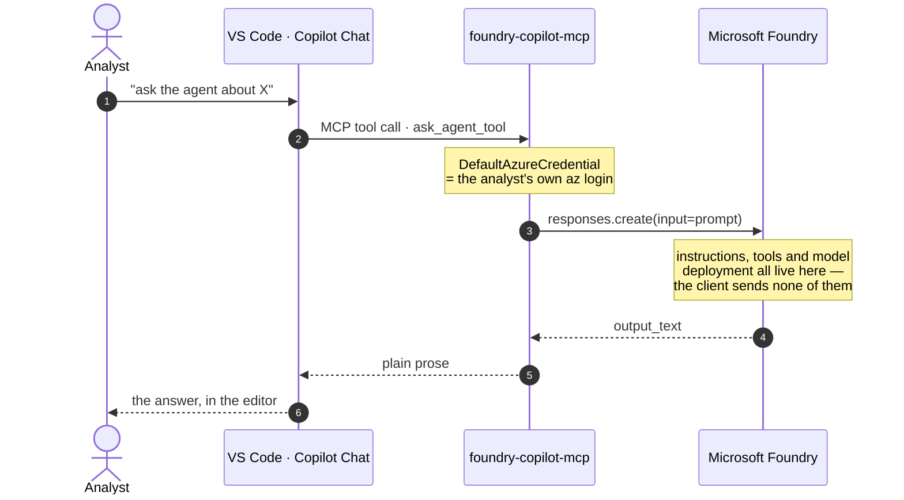

# Bridge 1 — a Foundry agent as a Copilot Chat tool

## The problem

You build an agent in Microsoft Foundry. It has instructions, a model deployment, maybe a couple of OpenAPI tools pointing at your own backend. In the playground it works.

Then you try to put it in front of people, and the playground stops being the answer. Users are not going to keep a portal tab open next to the editor they actually work in. So the options are:

1. **Rebuild the agent in the client.** Now the prompt lives in two places and drifts. Whoever owns the agent has to ship a client release to change a sentence.
2. **Wrap the raw model endpoint.** You lose the agent's tools and instructions; you are just calling a model.
3. **Expose the agent itself as a tool.** The client stays dumb. Foundry keeps the brain.

Option 3 is what this bridge does, and MCP is what makes it small.



Note what the client never sends: no model name, no system prompt, no tool definitions. Change the agent in the portal and step 4 picks it up on the next message.

## The code

```python
from azure.ai.projects import AIProjectClient
from azure.identity import DefaultAzureCredential

project = AIProjectClient(endpoint=PROJECT_ENDPOINT, credential=DefaultAzureCredential())
client  = project.get_openai_client(agent_name=AGENT_NAME)
reply   = client.responses.create(input=prompt).output_text
```

Three lines, and the important one is the middle.

`get_openai_client(agent_name=...)` hands back an OpenAI-shaped client **already bound to that agent**. Notice what is absent from `responses.create`: no `model`, no system prompt, no tool definitions. All of that is server-side. You are not calling a model that happens to have a prompt attached — you are calling the agent.

The practical consequence is the point of the whole exercise: **change the agent in the Foundry portal and every user gets it on their next message.** No client release, no version skew between the person who updated last week and the person who did not.

## Configuration

Two environment variables, set in `.vscode/mcp.json`:

| Variable | Example |
|---|---|
| `FOUNDRY_PROJECT_ENDPOINT` | `https://<resource>.services.ai.azure.com/api/projects/<project>` |
| `FOUNDRY_AGENT_NAME` | the agent's name in the portal |

Both are read at import time, so a missing one fails at startup with a message that says what to set — not three tool calls into a conversation.

## The `allow_preview` gotcha

The documented quickstart does not mention `allow_preview`. But some SDK builds share a code path with hosted agents and raise a `ValueError` demanding it. So:

```python
try:
    project = AIProjectClient(endpoint=..., credential=credential)
    client = project.get_openai_client(agent_name=AGENT_NAME)
except ValueError as exc:
    if "allow_preview" not in str(exc):
        raise                                    # a different problem: do not swallow it
    project = AIProjectClient(endpoint=..., credential=credential, allow_preview=True)
    client = project.get_openai_client(agent_name=AGENT_NAME)
```

Try the documented path first; opt into preview only when the SDK explicitly asks. Setting `allow_preview=True` unconditionally would work today and hide the day it stops being needed. Re-raising anything else keeps a genuine misconfiguration visible instead of turning it into a confusing preview error.

## Why `DefaultAzureCredential` matters

It resolves to the user's own `az login`. That is not just convenience — it decides who the agent is acting *as*.

With a service principal, every user shares one identity, and anything the agent reaches downstream sees that identity instead of the person asking. Any per-user access control below you stops working, silently. With `DefaultAzureCredential`, permissions follow the human, which is what everyone assumes is happening anyway.

## Writing the tool docstring

The docstring is not documentation. It is the prompt Copilot reads to decide whether to call your tool:

```python
@mcp.tool()
def ask_agent_tool(prompt: str) -> str:
    """Ask the Microsoft Foundry agent a question and return its answer.

    Use this for anything the agent is specialised in ...

    Do NOT use this to read a Power BI model: `inspect_model` does that directly and faster.
    """
```

Two habits that pay off immediately:

- **Say when *not* to use it.** With several tools available, the negative case is what stops the model reaching for the wrong one.
- **Return prose, not raw JSON.** The output goes to a language model that will paraphrase it for a human. Give it JSON and it will invent a summary; give it a sentence with the real numbers in it and it repeats them accurately.

## Cost and latency

Each `ask_agent_tool` call is a model call in your Foundry project, billed there. Copilot may also call it more than once in a single conversational turn if it decides it needs to. Worth knowing before you point it at an expensive deployment.
