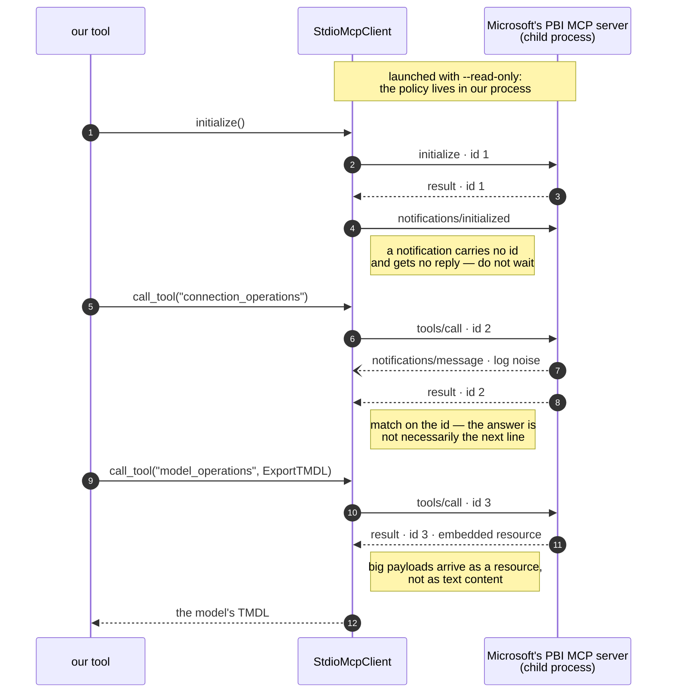

# Bridge 2 — an MCP server that is also an MCP client

Most MCP material shows you how to write a server. This is about the other half: making your server a *client* of somebody else's, and why that turns out to be the useful shape.

## Why put a server in front of a server

Microsoft ships an MCP server for Power BI semantic models. It works. You could hand it to your users directly — and then you would be handing them this:

```text
connection_operations { operation: ConnectFabric, workspaceName: ..., semanticModelName: ... }
model_operations      { operation: ExportTMDL, tmdlExportOptions: { ... } }
```

Correct, general-purpose, and not what anyone wants to type. Three reasons to wrap it:

**Opinions.** Vendor servers are general-purpose because they must be. Yours can be specific. Your users say "look at this model"; the wrapper turns that into connect → export → parse → summarise.

**Policy at the boundary.** This is the real prize. The child process is launched `--read-only`, so no chain of LLM calls can end up mutating a production model as a side effect of answering a question. The guarantee lives in *your* process, not in the prompt — and prompts are not a security boundary.

**Composition.** Your tool can hit the vendor server, your own API and a REST endpoint, then return one answer. The model never sees the seams.

## The protocol, minus the ceremony

JSON-RPC 2.0 over stdio, one JSON object per line.

```python
with StdioMcpClient("npx -y @microsoft/powerbi-modeling-mcp --read-only") as mcp:
    mcp.initialize()
    mcp.call_tool("connection_operations", {"request": connection})
    result = mcp.call_tool("model_operations", {"request": {...}})
```

What those three lines actually put on the wire:



Under that, four things bite.

### 1. The handshake has two steps, and the second gets no reply

```python
self._send("initialize", {...})                              # request  → expects a response
self._send("notifications/initialized", {}, notification=True)  # notification → no id, no reply
```

A notification carries no `id`. If you wait for a response to it, you hang forever. Skip it entirely and some servers refuse every subsequent call. Both failure modes look like "it just stopped working".

### 2. The answer you want is not necessarily the next line

Servers emit log notifications, progress events, and sometimes a plain-text banner before they get to your response. Reading "the next line" gets you a notification and desynchronises everything after it.

Match on the request `id`, and skip anything that is not it:

```python
while True:
    line = self._lines.get(timeout=self._timeout)
    if not line.strip().startswith("{"):
        continue                        # banners are not protocol messages
    message = json.loads(line)
    if message.get("id") == request_id:
        return message
```

### 3. A dead child blocks you forever

`for line in proc.stdout` on the main thread never returns if the process died without writing — which is exactly what a misconfigured server does (wrong package name, Node.js missing, no network for `npx`). Your MCP tool hangs, Copilot spins, and the user has nothing to act on.

So: read stdout on a daemon thread into a queue, and give every read a timeout. The failure becomes a message that names the command it tried to run.

### 4. A failed tool call is a *successful* JSON-RPC response

This one is easy to miss and quietly wrong:

```json
{"jsonrpc": "2.0", "id": 3,
 "result": {"isError": true, "content": [{"type": "text", "text": "model not found"}]}}
```

No `error` member — the transport worked fine. Check `result.isError` too, or a failed connection sails on and you parse an empty export as though it were an empty model.

### And one more: large payloads come back as resources

An exported model does not arrive as text content. It arrives as an embedded resource:

```json
{"content": [{"type": "resource", "resource": {"text": "table Sales\n\tmeasure ..."}}]}
```

Read only the `text` parts and you get an empty string, with no error to explain it. Hence `resource_texts()` alongside `text_content()`.

## Truncation, silently

```python
"tmdlExportOptions": {"serializationOptions": {"includeChildren": True},
                      "maxReturnCharacters": -1}
```

Without `maxReturnCharacters: -1`, large models come back truncated. The result still parses. You get a definition that is missing tables you never hear about — the worst kind of wrong, because nothing fails.

## Testing it without the real server

The tests spawn small Python scripts that speak JSON-RPC: an echo server, one that emits noise before answering, one that returns `isError`, one that never answers at all. That covers the framing, the notification handling, the error path and the timeout — no Node.js, no network, no Azure.

Mocking the client instead would have tested the mock. The framing bugs above only show up when something is genuinely reading and writing lines.

## Reusing it

`StdioMcpClient` knows nothing about Power BI. Point it at any MCP server:

```python
with StdioMcpClient("npx -y @some/other-mcp-server") as mcp:
    mcp.initialize()
    print(mcp.list_tools())        # useful when the docs are thin
```

`list_tools()` is genuinely the fastest way to find out what a server actually exposes, as opposed to what its README claims.
